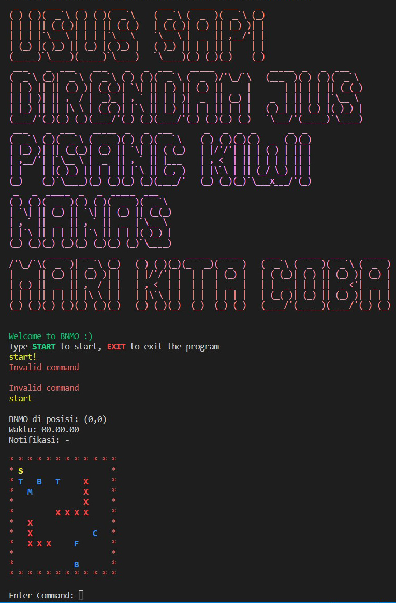

# BNMO
Tugas Besar IF2110 Algoritma dan Struktur Data

## Daftar Isi
* [Penjelasan Ringkas Program](#penjelasan-ringkas-program)
* [Cara Kompilasi Program](#cara-kompilasi-program)
* [Cara Menjalankan Program](#cara-menjalankan-program)
* [Pembagian Tugas](#pembagian-tugas)
* [Daftar Fitur](#daftar-fitur)
* [Status Pengerjaan](#status-pengerjaan)
* [Screenshot program](#screenshot-program)
* [Struktur Program](#struktur-program)


## Penjelasan Ringkas Program
BNMO adalah sebuah program yang mensimulasikan proses memasak mulai dari belanja, memotong, mencampur, merebus, dan menggoreng. Program BNMO berbasis CLI (Command Line Interface) yang ditulis dalam bahasa pemrograman C. Fitur-fitur dalam BNMO diimplementasikan dengan berbagai ADT (Abstract Data Type). Program ini juga mampu mensimulasikan makanan yang disimpan di kulkas dan memberi rekomendasi makanan kepada user.

## Cara Kompilasi
1. Pastikan pada device sudah terinstall gcc compiler
2. Pada root directory jalankan command `sh compile.sh`
3. Jika berhasil dilakukan kompilasi akan muncul file `main.exe` pada root directory

## Cara Menjalankan Program
1. Pastikan sudah melakukan kompilasi pada program
2. Pada root directory jalankan command `./main`
3. Jika berhasil di run, akan muncul splash screen 
##### Jika terjadi glitch yang dikarenakan pewarnaan pada CLI, jalankan program pada Windows Powershell

## Pembagian Tugas
| PIC                               	| JOBDESC                                                                                                                                                                                                                         	|
|-----------------------------------	|---------------------------------------------------------------------------------------------------------------------------------------------------------------------------------------------------------------------------------	|
| 13521046 Jeffrey Chow             	| ADT Matriks<br>ADT Mesin Karakter dan Kata<br>ADT List String<br>FITUR Catalog<br>FITUR Cookbook<br>FITUR Pengolahan Makanan<br>FITUR Waktu Pengolahan Makanan<br>LAPORAN Bab 2, 6                                              	|
| 13521057 Hosea Nathanael Abetnego 	| ADT Simulator<br>ADT List Statik<br>FITUR Simulator<br>FITUR PETA (move, aksi)<br>LAPORAN Bab 7, 8, 9                                                                                                                           	|
| 13521075 Muhammad Rifko Favian    	| ADT Queue<br>ADT Stack<br>FITUR Waktu<br>FITUR Undo/Redo<br>LAPORAN Bab 3, 4                                                                                                                                                    	|
| 13521077 Husnia Munzayana         	| ADT POINT<br>ADT WAKTU<br>FITUR Pemesanan Makanan dan Delivery<br>LAPORAN Bab 1, 3, 4                                                                                                                                           	|
| 13521101 Arsa Izdihar Islam       	| ADT Makanan<br>ADT Tree<br>ADT String<br>ADT List Dinamik<br>ADT Kulkas<br>ADT Multiset<br>FITUR Main, UI<br>FITUR Inisiasi<br>FITUR Parser<br>FITUR Notification<br>FITUR Kulkas<br>FITUR Rekomendasi Makanan<br>LAPORAN Bab 5 	|

## Daftar Fitur
1. Inisiasi
2. Simulator
3. Makanan
4. Resep
5. Inventory
6. Pemesanan Bahan Makanan
7. Peta
8. Pengolahan Makanan
9. Mekanisme Waktu
10. Undo/Redo
11. Catalog
12. Cookbook
13. Error Handling
14. Notifikasi
15. Kulkas
16. Waktu Pengolahan Makanan
17. Rekomendasi Makanan

## Status Pengerjaan
* Seluruh fitur selesai dikerjakan. 

## Screenshot Program


## Struktur Program
```bash
└───TubesAlstrukdat-K1C
    ├───adt
    │   ├───kulkas
    │   ├───listdin
    │   ├───liststatik
    │   ├───liststring
    │   ├───makanan
    │   ├───matriks
    │   ├───mesinkarakter
    │   ├───mesinkata
    │   ├───multiset
    │   ├───point
    │   ├───queue
    │   ├───simulator
    │   ├───stack
    │   ├───string
    │   ├───tree
    │   └───waktu
    ├───buy
    ├───catalog
    ├───color
    ├───command
    ├───cookbook
    ├───data
    ├───delivery
    ├───error
    ├───fridge
    ├───Map
    ├───olah
    ├───recommendation
    ├───schedule
    └───undoredo
```